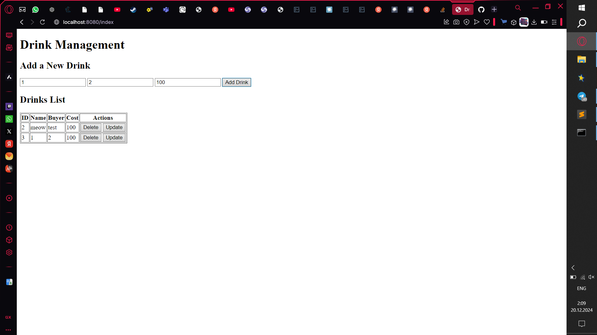

# Cashierless Cafe

## Description
Cashierless Cafe is a project aimed at creating a coffee shop system that operates without the need for a cashier. The system automates most cashier functions, providing a seamless and efficient experience for users. This project is targeted toward businesses looking to modernize their payment and order management systems.

## Team Members
- Zhaslan Aubakirov (SE-2321)

## Main Page Screenshot

## How to Start the Project
1. Ensure all dependencies are installed (refer to the tools and resources used).
2. Run the `start.bat` file to launch the server.
3. Open your browser and navigate to `http://localhost:8080/index` to access the main page.

## Tools and Resources Used
- **Backend**: Go
- **ORM**: GORM (for code-first database development)
- **Database**: PostgreSQL

## Additional Information
This repository includes all the necessary files, such as code, images, and configuration files, ensuring it is fully accessible for public viewing.
